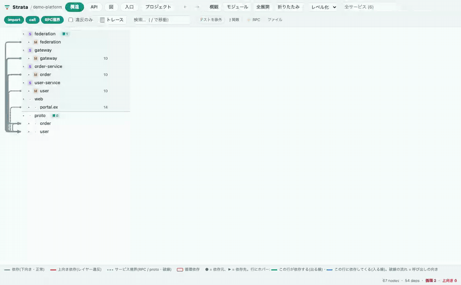
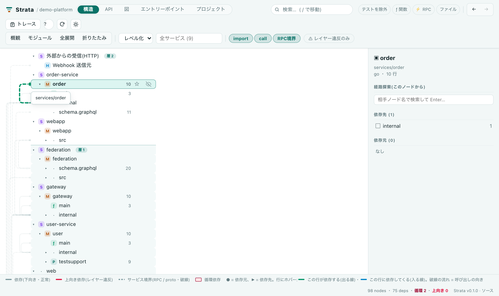
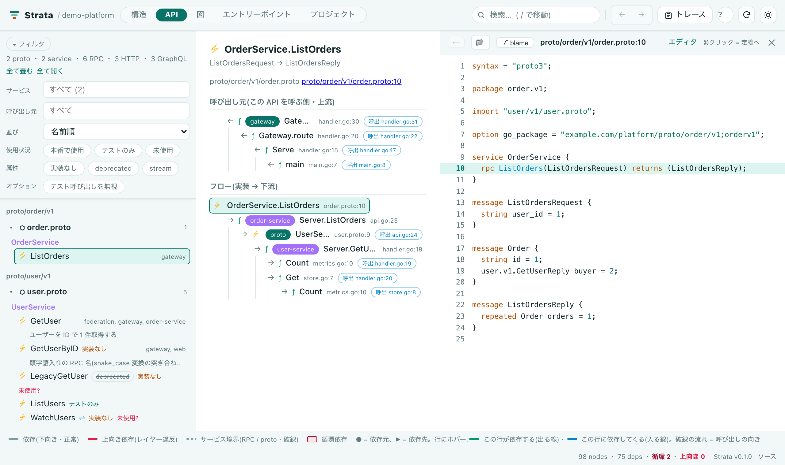
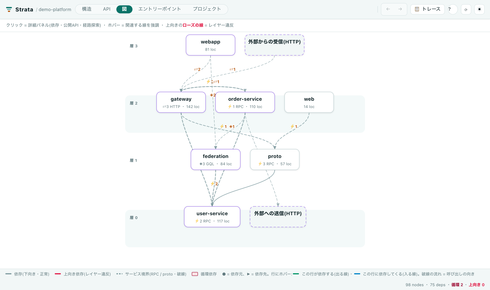
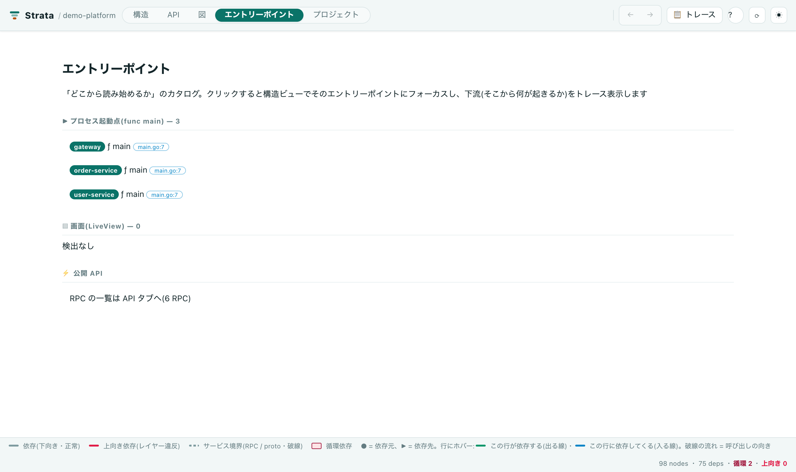
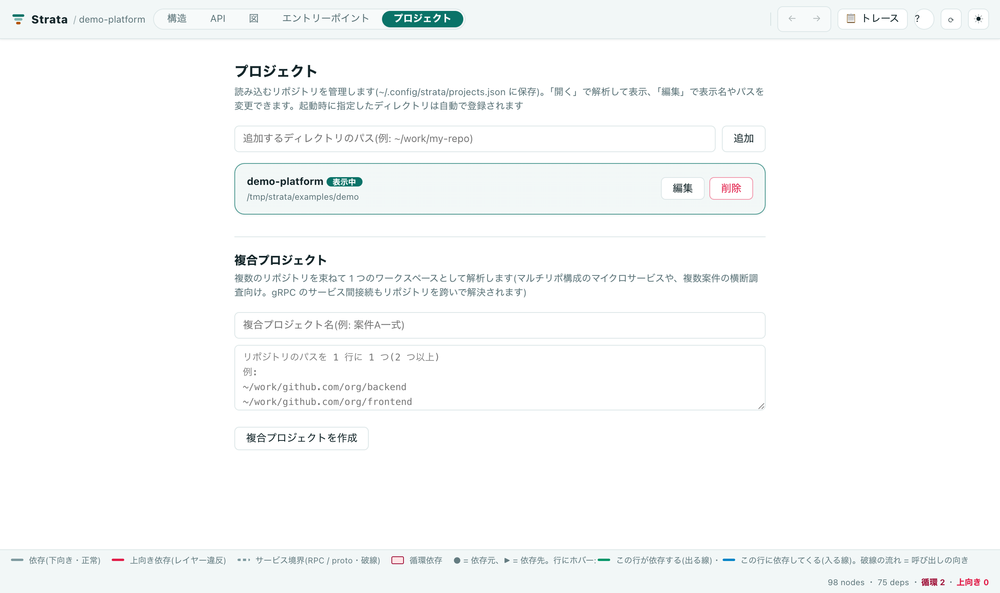
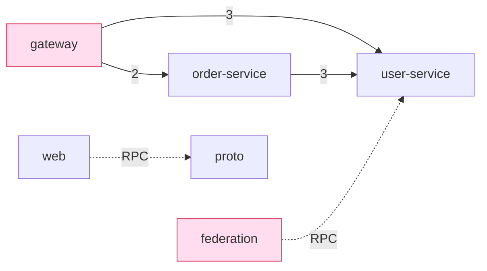

# Strata

[](https://github.com/makoto-developer/strata/actions/workflows/ci.yml)
[](https://makoto-developer.github.io/strata/)
[](LICENSE)
[](https://github.com/makoto-developer/strata/releases/latest)

**マイクロサービスのコードを「層」として読むための、依存関係とコールグラフの可視化ツール。**
gRPC・REST・GraphQL をまたいで、関数レベルで処理を追えます。

```sh
strata serve ./my-monorepo   # ブラウザで構造・API・アーキ図を見る
strata check ./my-monorepo   # CI で循環依存・レイヤー違反を検査する
```

> ### 📖 使い方の説明書 → **<https://makoto-developer.github.io/strata/>**
>
> インストール手順・各画面の見方・設定リファレンス・CI への組み込み方・
> 「なぜこの設計なのか」まで、まとまった説明書があります。
> この README は概要です。**実際に使うときはドキュメントサイトを見てください。**
>
> - [ボタンと操作の一覧](https://makoto-developer.github.io/strata/guide/toolbar/)(画像つき)
> - [構造ビューの読み方](https://makoto-developer.github.io/strata/guide/read-structure/)(線の色・向き・バッジ)
> - [API タブの読み方](https://makoto-developer.github.io/strata/guide/api-tab/)(未使用 API の判断・フローの読み方)

## こんなことになっていませんか

マイクロサービスを何年か運用すると、たいてい次の状態になります。

- **「この処理、どこ通ってる?」に誰も即答できない。** リポジトリが分かれ、言語も分かれ、
  全体像を持っている人がいない。仕様書はあるが、コードと合っている保証がない
- **proto を見ても「誰が呼んでいるか」が分からない。** RPC の定義は読めても、
  呼び出し元は別リポジトリ・別言語のどこかにある。grep しても当たらない
- **「この API はもう使われていない」と言い切れない。** だから消せない。
  消せないから、使われていないコードが永久に残る
- **REST・GraphQL・gRPC が混在していて、追跡がプロトコルの境目で途切れる**
- **アーキテクチャがレビューで守れない。** 「domain 層は infra を見ない」という決めごとは、
  差分レビューでは検出できないので、じわじわ崩れる

## Strata がやること

**サービスを起動せず、トレース基盤も入れず、静的解析だけで**この 5 つを埋めます。

| 困りごと | Strata の答え |
| --- | --- |
| どこを通っているか分からない | `⚡RPC → 実装ハンドラ → 関数 → 次のサービス` を**関数レベルで一本のフローとして表示** |
| 誰が呼んでいるか分からない | proto の RPC 名・HTTP のパス・GraphQL のフィールドで**呼び出し元を逆引き** |
| 使われていない API が消せない | 呼び出し元ゼロの API に **「未使用?」「テストのみ」バッジ**。棚卸しの根拠になる |
| プロトコルの境目で追跡が切れる | gRPC / REST / GraphQL / webhook を**同じグラフに載せる** |
| アーキテクチャが守れない | 循環依存・レイヤー違反・禁止依存ルールを **CI で検査**(違反で exit 1) |

## Strata の性格

導入のハードルを下げることを、機能より優先しています。

- 🔒 **完全ローカル・送信ゼロ。** テレメトリも自動アップデートチェックもありません。
  外部への通信コードが存在しないので、**社内のコードを外に出しません**
  (サーバーは `127.0.0.1` にのみバインドします)
- 📦 **実行時依存ゼロ。** `node_modules` を作りません。サプライチェーンの審査対象が
  「このリポジトリだけ」で済みます
- ⚡ **速い。** 実測で **1,050 ファイル / 1,644 ノードのモノレポを 0.26 秒**で解析
  (Apple M シリーズ、キャッシュなし)。待ち時間がないので気軽に何度でも回せます
- 🪶 **軽い。** 本体のコードは **約 530KB**(`src` + `web`)。
  バイナリ版は Node.js 同梱で 37MB(圧縮)
- 🔧 **言語のツールチェーンが要らない。** Go や Python を入れていないマシンでも、
  Go や Python のコードを解析できます(テキスト・構文レベルの解析)
- 🧱 **ビルド不要。** `git clone` して `node src/cli.ts serve .` で動きます
- 🌐 **オフラインで完結。** ネットワークが無い環境・閉域網でもそのまま使えます
- 📤 **成果物を共有できる。** `strata export` で **1 枚の自己完結 HTML**。
  サーバー不要で、Slack に投げれば相手のブラウザでそのまま開けます

## 既存のやり方との違い

| やり方 | 限界 | Strata |
| --- | --- | --- |
| 手描きのアーキテクチャ図 | 描いた瞬間から実装とずれる。根拠を確認できない | **コードから生成**。箱をクリックすれば関数と行まで降りられる |
| IDE の「参照を検索」 | 1 リポジトリ・1 言語の中で止まる。RPC の向こう側へ行けない | proto / パス / GraphQL フィールドで**サービス境界を越える** |
| 分散トレーシング(OpenTelemetry 等) | 実際に流れた経路しか見えない。**動かしていない経路は分からない**。導入コストも高い | 静的解析なので**実行しなくても全経路**が見える。導入は clone だけ |
| 既存の依存可視化ツール | 多くは 1 言語向け。ファイル/モジュール単位で止まることが多い | **多言語横断 + 関数レベル**。gRPC / REST / GraphQL を同じグラフに載せる |

**IDE 非依存。** 詳細仕様は [docs/SPEC.md](docs/SPEC.md)、設計の意図は
[なぜこの形なのか](https://makoto-developer.github.io/strata/why/) を参照してください。



> 上のデモは `strata serve examples/demo` の操作を録画したものです
> (再生成: [`scripts/record-demo.mjs`](scripts/record-demo.mjs))。

## 画面ツアー(何ができるか)

各タブは「答えたい問い」ごとに分かれています。画像はダーク / ライトの表示テーマに自動で追従します。

### 🗺 構造 — 「この依存、向きは正しいか?」

ツリー + 配線で依存を表示します。**上向きの線(ローズ) = レイヤー違反**、破線 = サービス境界越え。
行にホバーするとその行に繋がる線だけが残り、レベル化すると層(地層)ごとに帯が敷かれます。

<picture>
  <source media="(prefers-color-scheme: dark)" srcset="docs/assets/shots/structure-dark.png">
  
</picture>

### ⚡ API — 「この API は誰が呼んでいるのか?」

gRPC の RPC・HTTP エンドポイント・GraphQL フィールドを 1 つのカタログに。選ぶと
**呼び出し元(上流)と実装からの下流フロー**が出て、関数をクリックすればソースがその行で開きます。
「未使用?」「実装なし」「テストのみ」のバッジで、消せる API・未実装の API が一目で分かります。

<picture>
  <source media="(prefers-color-scheme: dark)" srcset="docs/assets/shots/api-dark.png">
  
</picture>

### 🧭 図 — 「サービス構成を人に説明したい」

サービス単位の箱と矢印。層ごとの帯、境界の呼び出し数(⚡RPC / ⇄HTTP / ◈GraphQL の内訳)、
外部システム(破線の箱)まで含めて俯瞰できます。箱をクリックすると依存元・依存先・公開 API が出ます。

<picture>
  <source media="(prefers-color-scheme: dark)" srcset="docs/assets/shots/diagram-dark.png">
  
</picture>

### 🚪 エントリーポイント — 「どこから読み始めればいい?」

`func main`・画面(LiveView)・操作イベントの一覧。クリックすると構造ビューでその位置にフォーカスし、
下流のトレースが始まります。新しくチームに入った人が最初に開くタブです。

<picture>
  <source media="(prefers-color-scheme: dark)" srcset="docs/assets/shots/entries-dark.png">
  
</picture>

### 📁 プロジェクト — 「複数リポジトリをまとめて見たい」

読み込むリポジトリの追加・編集・切り替え。**複数リポジトリを束ねた複合プロジェクト**にすると、
マルチリポ構成でも gRPC / HTTP のサービス間接続がリポジトリを跨いで解決されます。

<picture>
  <source media="(prefers-color-scheme: dark)" srcset="docs/assets/shots/projects-dark.png">
  
</picture>

> 画像は `strata serve examples/demo` の実画面です
> (再生成: [`scripts/capture-readme-shots.mjs`](scripts/capture-readme-shots.mjs))。
> ビューア右上の ◐ ボタンで **自動 / ライト / ダーク**を切り替えられます。



---

📖 **[説明書(ドキュメントサイト)](https://makoto-developer.github.io/strata/)** ・
❓ **[質問は GitHub Issue へ](https://github.com/makoto-developer/strata/issues/new?template=3_question.yml)** ・
🧪 **[サンプルシステム](https://github.com/makoto-developer/strata-sample-platform)**

## 目次

- [こんなことになっていませんか](#こんなことになっていませんか)
- [Strata がやること](#strata-がやること)
- [Strata の性格](#strata-の性格)
- [既存のやり方との違い](#既存のやり方との違い)
- [画面ツアー(何ができるか)](#画面ツアー何ができるか)
- [対応言語](#対応言語)
- [インストール](#インストール)
- [クイックスタート](#クイックスタート)
- [できること(機能一覧)](#できること機能一覧)
- [コマンドリファレンス](#コマンドリファレンス)
- [設定 `strata.config.json`](#設定-strataconfigjson)
- [CI 連携](#ci-連携)
- [ビューアの使い方](#ビューアの使い方)
- [解析の仕組みと限界](#解析の仕組みと限界)
- [使っているもの・謝辞](#使っているもの謝辞)
- [ライセンス](#ライセンス)

## 対応言語

**Go / TypeScript / JavaScript / Python / Elixir / Protocol Buffers(gRPC)**。
Go/Python 等のツールチェーンは**不要**(テキスト・構文レベルの静的解析)。

## 必要環境

- Node.js **22.18 以上**(TypeScript を直接実行するため。外部依存ゼロ・ビルド不要)
- 解析対象のリポジトリ

## インストール

配布は **GitHub 公開のみ**(npm には公開していません)。

### macOS(Apple Silicon)アプリ — 端末を使わない人はこれ

```sh
curl -fsSL https://raw.githubusercontent.com/makoto-developer/strata/main/install.sh | bash
```

これだけで `/Applications/Strata.app` に入ります。あとは Launchpad や Finder から
**ダブルクリックするだけ**です。インストーラは dmg を取得してチェックサムを照合し、
配置したうえで隔離属性を外します([中身はこちら](install.sh))。

ダブルクリックすると:

1. 初回はフォルダ選択が出るので、解析したいリポジトリを選ぶ(2 回目以降は前回のフォルダで起動)
2. ビューアが既定のブラウザで開く
3. 小さなウィンドウが残るので、終わるときは「終了」を押す(サーバも一緒に止まります)

別のリポジトリに切り替えたいときは、そのウィンドウの「別のフォルダ…」か、
ビューアの「プロジェクト」タブから追加・切り替えができます。

アプリの中には CLI も同梱しています。端末からも使いたい場合はこれを PATH に置けます:

```sh
sudo ln -sf /Applications/Strata.app/Contents/MacOS/strata-cli /usr/local/bin/strata
strata --version
```

<details>
<summary>dmg を手で入れたい場合(インストーラを使わないとき)</summary>

[最新リリース](https://github.com/makoto-developer/strata/releases/latest)の
`Strata-macos-arm64.dmg` を開き、`Strata.app` を `Applications` へドラッグしたあと、
**次の 1 行が必要です**。

```sh
xattr -dr com.apple.quarantine /Applications/Strata.app
```

これをしないと「"Strata"は壊れているため開けません。ゴミ箱に入れる必要があります。」と出ます。
アプリが壊れているわけではなく(署名の検証自体は通ります)、Apple の**公証を受けていない**ためです。
ダウンロード時に付く隔離属性があると macOS がこう表示します。
**macOS 15 (Sequoia) 以降では「右クリック → 開く」では回避できません**(Apple が廃止したため)。
上の 1 行インストーラは、この手順まで済ませます。

</details>

### macOS(Apple Silicon)バイナリ — CLI だけ欲しい人はこれ

Node.js のインストール不要。ランタイム同梱の単一実行ファイルです。

```sh
curl -fsSL https://github.com/makoto-developer/strata/releases/latest/download/strata-macos-arm64.tar.gz | tar xz
sudo mv strata /usr/local/bin/
strata --version
```

| 項目 | サポート |
| --- | --- |
| OS | **macOS 13 Ventura 以降** |
| CPU | **Apple Silicon(M1 / M2 / M3 / M4 …)**。Intel Mac 用は提供していません |
| 同梱ランタイム | Node.js v24.18.0 |

ad-hoc 署名のみ(Apple の公証なし)です。ブラウザでダウンロードした場合は
`xattr -d com.apple.quarantine ./strata` で隔離属性を外してください。
Intel Mac / Linux / Windows では下記の git clone 版を使ってください(機能は同じです)。

### Homebrew

```bash
brew tap makoto-developer/strata
brew trust makoto-developer/strata   # 公式以外の tap は明示的な信頼が必要(Homebrew の仕様)
brew install strata

strata --version
strata serve /path/to/your-monorepo
```

> `brew trust` を省くと `Refusing to load formula from untrusted tap` で止まります。
> 新しめの Homebrew が、公式以外の tap を既定では読み込まなくなったためです。
> Apple Silicon では Node.js 同梱のバイナリが、Intel Mac / Linux ではソース + Homebrew の
> `node` が入ります(いずれも同じ機能です)。

### mise / asdf(Node を用意して git 導入)

```bash
mise use -g node@22.18          # asdf の場合: asdf install nodejs 22.18.0
git clone https://github.com/makoto-developer/strata.git
cd strata && npm link           # `strata` コマンドが使えるようになる
strata serve /path/to/your-monorepo
```

### git clone のみ(インストール不要)

```bash
git clone https://github.com/makoto-developer/strata.git
node strata/src/cli.ts serve /path/to/your-monorepo
```

## クイックスタート

```bash
# ① ビューアを起動(ブラウザで http://localhost:7333/。--watch で変更を自動反映)
strata serve /path/to/your-monorepo --watch

# ② コールツリーを端末で(--up で呼び出し元をたどる)
strata trace /path/to/your-monorepo 'Gateway.handleUser'

# ③ 循環依存 + アーキテクチャルールを CI で検査(問題があれば exit 1)
strata check /path/to/your-monorepo

# ④ サービス結合度メトリクス
strata metrics /path/to/your-monorepo
```

### まず試す(同梱デモ)

```bash
strata serve examples/demo
strata trace examples/demo 'Gateway.handleUser'
strata check examples/demo     # 意図的に仕込んだ循環 2 件で exit 1
strata metrics examples/demo
```

`strata metrics examples/demo` の出力例:

```
service               Ca   Ce   I      loc      api
────────────────────────────────────────────────────
proto                 5    0    0.00   57       6
user-service          3    1    0.25   117      0
gateway               0    3    1.00   83       0
order-service         1    2    0.67   51       0
```

`Ca`=依存される数, `Ce`=依存する数, `I`=不安定度 `Ce/(Ca+Ce)`。
I が高いほど「多くに依存し変更の影響を受けやすい」、低いほど「多くに依存され変更の影響範囲が広い」。

## できること(機能一覧)

### 🗺 可視化・探索(ビューア)
- **構造ビュー**: メトロ路線図風の配線 + レベル化 + 地層(strata)バンド。
  「上向き依存 = レイヤー違反」「循環依存」が一目で浮かび上がる
- **API タブ**: gRPC(proto / service / RPC)・⇄HTTP エンドポイント・◈GraphQL フィールドを
  1 つのカタログにまとめて表示 + フロー表示。
  `⚡RPC → 実装ハンドラ → 関数 → ⚡別サービスの RPC` をサービス境界越しに辿れる
- **図タブ**: サービス単位のアーキテクチャ図。依存を**関数レベルまで展開**できる
- **エントリーポイントタブ**: プロセス起動点(main)・画面(LiveView)・操作イベントの一覧
- **ソース表示**: シンタックスハイライト・定義ジャンプ・ホバープレビュー・git blame / commit / PR
- **⭐ ブックマーク**: 気になるノードに印を付けて一覧からすぐ飛ぶ(`b` キー)
- **キーボード操作**: `↑↓←→` で移動・展開、`/` で検索、`b` でブックマーク、`Esc` で閉じる、`Alt+←→` で戻る/進む(`?` で一覧)
- **URL 共有**: focus / 検索 / 並びが URL に反映され、リロード復元・共有できる
- **watch**: `serve --watch` でファイル変更時にブラウザ自動リロード

### 🔬 解析
- **多言語**: Go / TS / JS / Python / Elixir / proto / GraphQL SDL を横断解析
- **gRPC サービス境界**: proto を「正」として `クライアント関数 → ⚡RPC → サーバ実装` を接続
- **⇄ HTTP / REST**: gin / echo / chi / gorilla mux / net-http(Go 1.22 の `"GET /path"` も)/
  Express / Fastify / Hono / Next.js App Router / FastAPI / Flask / Phoenix Router のルートを検出し、
  `fetch` / `axios` / `http.NewRequest` / `requests` などの呼び出しとパスで突き合わせて接続
- **🪝 webhook**: `/webhooks/...` の受信口と外部 SaaS への送信を「外部システム」として分けて可視化
- **◈ GraphQL**: SDL の Query / Mutation / Subscription をノード化し、リゾルバ実装(gqlgen / Apollo)、
  クライアントの `gql\`query\`` 操作、federation の `extend type @key` によるサブグラフ間参照を接続
- **循環依存検出**(Tarjan SCC)/ **レイヤー違反**の可視化
- **🛡 gRPC インターセプタ検出**: 認可等の横断ミドルウェアを検出し、サービス/フローに表示
- **⚙ 設定サーフェス**: 各サービスが要求する環境変数を検出
- **✉ 非同期(Pub/Sub)**: `messaging` 設定で publish/subscribe をトピック経由の依存として可視化

### 🛡 ガバナンス・CI
- **アーキテクチャルール検査**: 禁止依存を宣言して CI で fail(`check`)
- **SARIF 出力**: 循環・ルール違反を GitHub Code Scanning に注釈(`check --sarif`)
- **循環ベースライン**: 既知の循環を許容し新規だけ fail(`check --baseline`)
- **差分分析**: 2 つの git ref を比較し、依存増減・新規/解消の循環を検出(`diff`)

### 📤 出力
- **自己完結 HTML** エクスポート(`export`)/ **mermaid + Markdown レポート**(`report`)
- **結合度メトリクス**(`metrics`)

## コマンドリファレンス

| コマンド | 説明 |
| --- | --- |
| `strata serve [dir\|model.json] [--port N] [--watch]` | ビューアを起動(既定 7333) |
| `strata scan [dir] [-o model.json]` | 依存モデル(JSON)を出力 |
| `strata check [dir\|model.json] [--json] [--baseline F] [--update-baseline] [--sarif -o f]` | 循環 + ルール検査(exit 1) |
| `strata metrics [dir\|model.json] [--json]` | サービス結合度(Ca/Ce/不安定度) |
| `strata diff <old> <new> [--json]` | 2 モデルの差分(依存増減・循環) |
| `strata trace [dir\|model.json] <関数名/ID> [--up] [--depth N]` | コールツリー表示 |
| `strata report [dir\|model.json] [-o report.md]` | mermaid + メトリクス + Markdown |
| `strata export [dir\|model.json] [-o report.html]` | 自己完結 HTML |
| `strata init [dir] [--force]` | `strata.config.json` の雛形を生成 |

## 設定 `strata.config.json`

ワークスペースルートに置きます(すべて任意)。

```jsonc
{
  "name": "my-platform",
  "services": [                       // サービスのグルーピング(表示上の最上位階層)
    { "name": "gateway", "path": "gateway" },
    { "name": "user-service", "path": "services/user" }
  ],
  "exclude": ["experimental", "**/e2e/**"], // 除外(パス前方一致 / ディレクトリ名 / グロブ)
  "includeTests": false,              // テストコードをグラフに含めるか(既定: false)
  "testPaths": ["tools/test-client"], // テスト扱いにする追加パス

  // アーキテクチャルール: 禁止依存(check で違反すると exit 1)
  "forbidden": [
    { "name": "domain-no-infra", "from": "**/domain", "to": "**/infra",
      "comment": "ドメイン層はインフラを参照しない" },
    { "name": "handler-no-repo", "from": "**/handler", "to": "**/repository",
      "comment": "ハンドラは repository を直接触らずユースケース経由にする" }
  ],

  // 数値しきい値: 超えると check が exit 1(結合度・循環の fitness function)
  "thresholds": {
    "maxCycles": 0,          // 循環グループ数の上限
    "maxInstability": 0.85,  // 各サービスの不安定度 I の上限
    "maxEfferent": 8         // 各サービスが依存する数(Ce)の上限
  },

  // 非同期(Pub/Sub)検出: 発行/購読メソッド名を指定(opt-in・既定は無効)
  "messaging": {
    "publish": ["Publish", "Emit"],
    "subscribe": ["Subscribe", "On"]
  },

  // HTTP(REST / webhook)検出。既定は有効
  "http": {
    "enabled": true,
    "externalHosts": true,             // 未解決の絶対 URL を「外部システム」ノードにする
    "webhookPatterns": ["/callbacks/"] // webhook 扱いにするパスの追加パターン
  },

  // GraphQL 検出。既定は有効
  "graphql": { "enabled": true }
}
```

- `forbidden` の `from`/`to` はノード id・ラベルへの**グロブ**(`**/` は 0 段以上の階層、`*` は 1 階層)。
  エッジ端とその祖先に照合するので、パッケージ単位のルールが関数エッジにも効きます。
  グロブを含まないパターンは**パス片(セグメント)単位**で一致します(`web` は `web/src/...` に当たり、
  `webhook-in` のような部分文字列には当たりません)。
- `messaging` を設定すると `bus.Publish("order.created", …)` のような呼び出しを検出し、
  `publisher → ✉topic → subscriber` のイベント辺を張ります。

## CI 連携

### 循環 + アーキテクチャルール(GitHub Actions)

```yaml
- uses: actions/setup-node@v4
  with: { node-version: 22 }
- run: git clone --depth 1 https://github.com/makoto-developer/strata.git
- name: アーキテクチャ検査
  run: node strata/src/cli.ts check .
```

### GitHub Code Scanning(SARIF で PR に注釈)

```yaml
- name: Strata 検査(SARIF)
  run: node strata/src/cli.ts check . --sarif -o strata.sarif || true
- uses: github/codeql-action/upload-sarif@v3
  with: { sarif_file: strata.sarif }
```

### 差分で新規の循環だけ fail

```bash
# ベースブランチとトピックブランチそれぞれで scan → diff
node strata/src/cli.ts scan base/   -o base.json
node strata/src/cli.ts scan .       -o head.json
node strata/src/cli.ts diff base.json head.json   # 新規循環があれば exit 1
```

## ビューアの使い方

- **1 行 = 1 要素**(S=サービス / M=モジュール / P=パッケージ / ⬢ proto / ƒ 関数 / ⚡ RPC / ✉ トピック)。
  ▸/▾ で展開・折りたたみ
- 依存は**左レーンのメトロ配線**。▶ の先が依存先、**グレー=下向き(正常)/ローズ=上向き(レイヤー違反)**。
  **破線=RPC / proto / イベント境界**、太さ=依存数、**赤背景=循環**
- 行クリックで**フォーカス**(緑=依存先, 青=依存元)。関数/RPC を選ぶと**コールツリー**を表示
- **⭐ ブックマーク**: 行の ☆ か `b` キーで登録、ヘッダの「★ n」から一覧・ジャンプ
- **キーボード**: `↑↓` 移動 / `→←` 展開・折りたたみ / `Enter` 開閉 / `/` 検索 / `Esc` 閉じる / `Alt+←→` 戻る・進む
- サービスを選ぶと、依存先/依存元・公開 API の使用状況・**🛡 インターセプタ**・**⚙ 環境変数**を表示。
  依存は**関数レベルまで展開**でき、各関数はクリックで移動

### プロジェクト管理

「プロジェクト」タブで複数リポジトリを登録・切替(`~/.config/strata/projects.json`)。
**複合プロジェクト**で複数リポを 1 つの依存グラフとして解析できます。

## 解析の仕組みと限界

- テキスト・構文レベルの静的解析(型推論なし)。**誤検出より取りこぼしを優先**する方針で、
  グラフに出ている依存は実在するものだけにしている
- サービス間接続は proto を「正」とし、`go_package` / 生成スタブ / RPC 名の突き合わせで接続する
- **生成クライアントライブラリを挟む構成**(proto → tag 付き生成物 → 別リポジトリの呼び出し元)は
  `indirection` 設定で解決する。置き場所の規約は設定不要で、生成コードの中身
  (フルメソッド名 `"/acme.user.v1.UserService/GetUser"`、または `typeName` と RPC 名の組)を
  署名にして生成物を同定する。読みに行くファイルは拡張子・命名で足切りしており、
  独自の命名は `artifactPaths` で足す。照合は proto の package を含む完全修飾名で行い、
  決め手が無ければ繋がず「未解決」として残す
- **Gateway / Federation のような中継層**は「中継候補」として印を付けるだけにしている。
  呼び出し元がどの実装に到達するかは実行時に決まるため、層数・順序・到達先は示さない
- interface 越しの呼び出し・高階関数・リフレクションは追跡しない。
  自前 Facade や DI コンテナ越しの gRPC 呼び出しも、呼び出し側にシンボルが残らないので追跡しない
- メッセージキュー経由の依存は `messaging` 設定で検出(未設定なら対象外)。
  トピック名が環境変数で与えられる場合は `infra` 設定で Kubernetes / Helm / Terraform から逆引きする。
  実行時に組み立てられる名前は推測せず未解決として残す
- 生成物の探索は既定では `node_modules` を歩かない(`artifactPaths` に書けば読む)
- 解決できなかった参照は `strata unresolved` で一覧でき、設定を書く手掛かりになる
- 詳細と各言語の対応範囲: [docs/SPEC.md](docs/SPEC.md)

## 開発

```bash
npm test         # CLI・解析エンジン + ビューア/サーバの DOM/HTTP スモーク
npm run typecheck # tsc --noEmit(strict)
```

## 使っているもの・謝辞

Strata 本体は**実行時依存ゼロ**ですが、開発・配布・ドキュメントでは次の OSS を利用しています
(いずれも各リポジトリのライセンスを確認し、条件の範囲内で利用しています)。

| 用途 | プロジェクト | ライセンス |
| --- | --- | --- |
| 実行ランタイム(バイナリに同梱) | [Node.js](https://github.com/nodejs/node) | MIT |
| 単一実行ファイルへの blob 注入 | [postject](https://github.com/nodejs/postject) | MIT |
| ビルド時のバンドル | [esbuild](https://github.com/evanw/esbuild) | MIT |
| 型チェック(devDependency) | [TypeScript](https://github.com/microsoft/TypeScript) | Apache-2.0 |
| スクリーンショット・デモ録画(開発時のみ) | [Playwright](https://github.com/microsoft/playwright) | Apache-2.0 |
| ドキュメントサイトの生成 | [Jekyll](https://github.com/jekyll/jekyll) | MIT |
| ドキュメントサイトのテーマ | [Just the Docs](https://github.com/just-the-docs/just-the-docs) | MIT |
| 行動規範の原文 | [Contributor Covenant](https://www.contributor-covenant.org/) v2.1 | CC BY 4.0(出典表記は [CODE_OF_CONDUCT.md](CODE_OF_CONDUCT.md) に記載) |

esbuild / postject / Playwright は `npm install --no-save` で**都度入れて使う**方式にしており、
`package.json` の依存には含めていません(利用者側のインストールには不要です)。

また、レポートの図生成には [Mermaid](https://github.com/mermaid-js/mermaid)(MIT)の記法を出力しています
(Strata 自体は Mermaid を同梱せず、GitHub 等のレンダラに任せています)。

### 着想について

「依存関係を層(strata)として捉え、レイヤー違反を可視化する」という発想は、
アーキテクチャ可視化ツール一般の考え方に基づくものです。コード・アイコン・文言は
すべて本プロジェクトのオリジナルで、他ツールからの流用はありません。

## ライセンス

**AGPL-3.0-only** で提供します([LICENSE](LICENSE))。Copyright (c) 2026 makoto-developer.

- ツールとして使う(実行する)だけなら、個人・企業を問わず無料で自由です
- 改変版の配布や、本ツールを組み込んだサービスの提供にはソース公開義務があります。
  別条件(商用ライセンス等)が必要な場合は作者に相談してください
- 貢献の条件は [CONTRIBUTING.md](CONTRIBUTING.md) を参照

本ツールは完全な独自実装です(他製品のコード・アセットの流用はありません)。

配布物に含まれる第三者コードの表記:

- **macOS 向けバイナリ**には Node.js(MIT)を同梱しています。ライセンス全文は
  アーカイブ内の `THIRD-PARTY-NOTICES.txt` に同梱しています
- ソース配布物に第三者コードは含まれません(実行時依存ゼロ)。開発・ビルドで使う OSS は
  [使っているもの・謝辞](#使っているもの謝辞)を参照してください

質問・不具合の窓口は [SUPPORT.md](SUPPORT.md) を参照してください。
